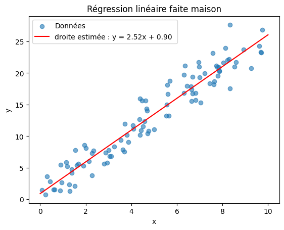

# Stoneage  ZHARDILE

6 semaines pour comprendre les modèles de l'intérieur puis construire avec, 
Programme: Kapathy 0 to hero + Hugging face agents; Début 11/07/2026

## Journal
### Jour 1- 11/07/26
- setup complet: Github, Colab GPU, comptes API, DISCORD 

- Premier commit depuis en ligne de commande depuis un CODESPCACE

--programme prévu pour le premier jour complété, utilsation de Colab, verification des biblioteques, du T4, découverte de Gitbhub, révisions du Python CPGE plus nouvelles fonctions

### Jour 2- 12/07/26:
-Fin des rappels et compléments de python, 
-Découverte et utilisation des class,methodes, et réalisation de mes propres bibliotheques (élementaires) --modules en realité--;  Vec2 pour des vecteurs dans le plan, Polynomes, et Fraction avec pour chacun definition de leur represenation, __add__,__mul__, et autres fonctions spécifiques.

### jour 4 : 17/ 07 / 26:
NUMPY, softmax, regression maison

